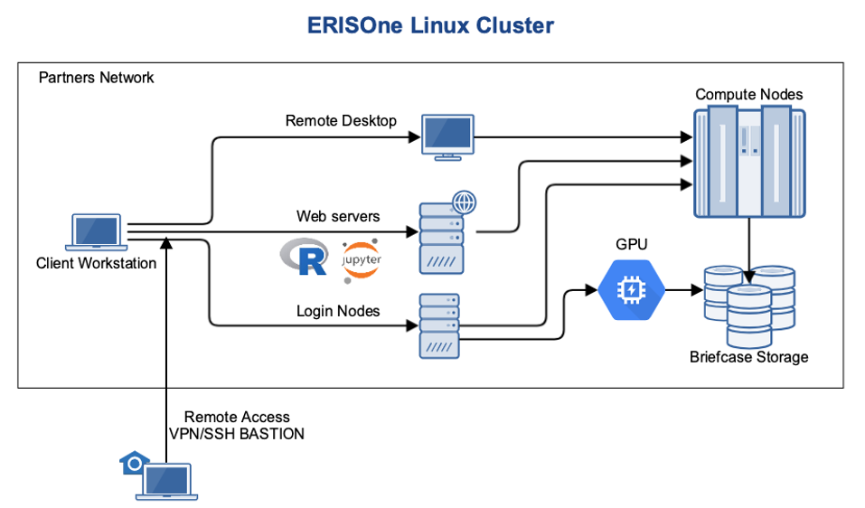

# ERISOne Cluster
ERISOne is a cluster of scientific computing resources which uses compute nodes connected to a high speed storage. This
cluster runs on a Linux operating system and is maintained by Partners HealthCare. In the figure attached below, the main 
structure of ERISOne can be appreciated (image taken from their 
[training slides](https://confluence.partners.org/pages/viewpage.action?spaceKey=ERISONE&title=Training+Slides))

This platform is suitable for running jobs in parallel that also require high speed access to data files. The jobs are sent to
the compute nodes with a job scheduling system that queues and dispatches them. The main advantage of ERISOne is that offers 
very powerful computation tools, thus, avoiding users to buy expensive work stations, who can connect and use the resources
directly from their personal computers.

Despite all the advantages that ERISOne offers, setting up the platform for specific job purposes can be sometimes challenging.
In this section, the main steps to properly configure it are explained. Further configurations can be found in 
[here](https://erikreinertsen.com/setting-up-erisone/).

Note that an ERISOne account is needed to follow this steps. If the reader does not have one go to the 
[account request form](https://rc.partners.org/erisone-cluster-account-request) to request it. Furthermore, it is assumed
that the user is connected via SSH (see how to connect [here](https://rc.partners.org/kb/article/2814)).

## Setting up ERISOne
### Load modules
Tensorizer as well as all the other modes implemented run in Python. Therefore, the first step is to set up the proper 
Python and Anaconda versions, so the environment with the desired libraries can be installed easily. In ERISOne this is 
done by loading the desired modules. Since the version of Python and Anaconda are very new, first the testing modules have 
to be enabled. This is done with the following commands:

    # On the ERISOne login node, type:
    touch $HOME/.lmod
    exit
    # Once exited, log back in again

Enabled the testing modules, the proper Anaconda version to have Python 3.7 can be loaded:
    
    # On the ERISOne login node, type:
    module load Anaconda3/5.2.0
    
### Send code to ERISOne
Then, it is time to send the code that is wanted to be run. To do so, if this code is in a repo, it can be cloned with `git`:

    # On the ERISOne login node, type:
    module load git
    git clone https://github.com/<repo-name>.git

Otherwise, it can be send via `scp`:
    
    # On the local machine, type:
    scp -r <local_directory> ab123@erisone.partners.org:~/<desired_directory>
    # ab123 is your ERISOne username

### Install environment
In order to install the environment, if the `icu` repo is used, one can follow the instructions on this 
[READ ME](https://github.com/aguirre-lab/icu-wiki.git). Otherwise, the following process can be followed:

    # On the ERISOne login node, type:
    conda env create -f <file_environment_name>.yml
    pip install -e .

After that, the desired environment must be activated. It is important to remark that the environment is activated 
with `source` command and not `conda`:

    # On the ERISOne login node, type:
    source activate <name_environment>

### Send files to ERISOne
One way to send files to ERISOne is to use the command `scp` as explained previously. However, if a lot of files need to be 
moved constantly, it may be interesting to mount ERISOne Home directory to the local machine. In this way, files can be moved
from one folder to another of your local machine. One possible option to mount ERISOne is by following the commands below.
First, creating an empty directory

    # On the local machine, first create the desired directory:
    MOUNTDIR="/erisone/$USER"
    sudo mkdir -p $MOUNTDIR

Then, the directory can be mounted:

    # On the local machine
    sudo sshfs -o allow_other $USER@erisone.partners.org:/PHS/home/$USER/<desired_folder> $MOUNTDIR

Doing so, the `<desired_folder>` is mounted on your local machine.

## Sending jobs to compute nodes
Once the login node is set up, the jobs must be sent to compute nodes. The main difference between both is that login nodes
are servers where you are connected via ssh, and the activities allowed on this nodes are limited to 
writing job scripts, submitting jobs and small file operations. On the other hand, compute nodes 
are high-powered servers which run tasks sent through the job scheduler. Note that a job can be understood as an instance
sent to the job scheduler, in which the resources and other options are determined, as well as the task (script, mode or algorithm)
 to be executed.

### Script to send jobs
It is important to know how to send jobs to compute nodes properly. First of all, it should be pointed out
that ERISOne uses a batch scheduler called LSF (more information can be found in the 
[IBM Platform LSF Documentation](https://www.ibm.com/support/knowledgecenter/en/SSETD4_9.1.3/lsf_welcome.html)). Therefore, 
a `BASH` script with the extension `.lsf` must be created to send and run the job.

Following, an example of script (`example.lsf`) is presented:
    
    #!/bin/bash

    #BSUB -J test
    #BSUB -o output/test-%J.out
    #BSUB -e output/test-J.err
    #BSUB -q big
    #BSUB -n 6
    #BSUB -M 5000
    #BSUB -R rusage[mem=5000]
    #BSUB -u ab123@mgh.harvard.edu

    ml4icu tensorize <args>

In the previous script, a job is sent with the following characteristics: with name `test`, it is sent to the queue `big`, 
using `6` cores and `5 GB` of RAM. The work to be performed is a tensorization process (`ml4icu tensorize`). Once the job is 
finished, a notification is sent to the `ab123@mgh.harvard.edu` email.

In order to send the job, the command is:
    
    # On the ERISOne login node, type:
    bsub < example.lsf

The table presented below contains a small explanation of the main LSF commands:

| Command | Description |
| --- | --- |
| `-J` | Assigns the specified name to the job. |
| `-o` | Appends the standard output of the job to the specified file path. |
| `-e` | Appends the standard error output of the job to the specified file path. |
| `-q` | Submits the job to one of the specified queues. |
| `-n` | Submits a parallel job and specifies the number of tasks in the job. |
| `-M` | Sets a per-process (soft) memory limit for all the processes that belong to this job. |
| `-R` | Runs the job on a host that meets the specified resource requirements. |
| `-u` | Sends mail to the specified email destination. |

### Understanding resources and queue selection
Jobs can be submitted in different queues that ERISOne provides. However, each queue determines the computational resources
that can be used for the job. Thus, it is of importance to know how many resources your job needs to be processed properly.

If the user has a work station it is easy to check the resources (RAM and number of CPUs) with `htop` command. If that is not 
the case, then, ERISOne provides an interactive session where the code can be checked (find possible errors) and also 
estimate needed resources (read more information [here](https://rc.partners.org/kb/article/2680)). For example, to start the
session with a resource reservation of 4 CPUs and 10GB of RAM, the following command should by typed:

    # On the ERISOne login node, type:
    bsub -Is -R 'rusage[mem=10000]' -n 4 /bin/bash

Finally, it is worth to know what are the possible queues that ERISOne offers and which are their resources. The next table summarizes
this information.

| Queue | Default Mem | Max Mem | Min Runtime | Max Runtime | CPU |
| --- | --- | --- | --- | --- | --- |
| vshort | 1 GB | 4 GB | - | 15 min | 1 |
| short | 2 GB | 4 GB | 10 s | 1 h | 1 |
| medium | 2 GB | 8 GB | 1 min | 24 h | < 4 |
| normal | 2 GB | 8 GB | 1 min | 3 days | < 6 |
| long | 2 GB | 8 GB | 1 min | 1 week | < 4 |
| vlong | 2 GB | 8 GB | 1 min | 4 week | < 4 |
| big | 8 GB | 498 GB | 1 min | 4 weeks | < 6 |
| big-multi | 8 GB | 498 GB | 1 min | 4 weeks  | 4 - 12 |